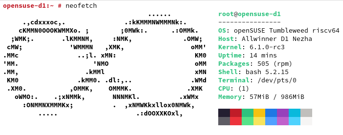

# ⚠ DEPRECATION NOTICE ⚠

This image is not in development anymore. Please refer to the [openSUSE upstream image](https://en.opensuse.org/HCL:MangoPi_MQ-Pro) instead.

# Build openSUSE images for the Allwinner D1



This repository contains scripts for building an openSUSE image for the Allwinner
D1. This work is heavily inspired by the excellent [riscv-arch-image-builder](https://github.com/sehraf/riscv-arch-image-builder).

## Components

- [OpenSBI](https://github.com/smaeul/opensbi)
- [U-Boot](https://github.com/smaeul/u-boot.git)
- [Kernel](https://github.com/smaeul/linux)
- [WiFi driver (rtl8723ds)](https://github.com/lwfinger/rtl8723ds)
- [openSUSE Tumbleweed JeOS root fs](https://download.opensuse.org/ports/riscv/tumbleweed/images/openSUSE-Tumbleweed-RISC-V-JeOS.riscv64-rootfs.riscv64.tar.xz) (root password is `linux`)

## How to build

This guide assumes you are using an up-to-date installation of openSUSE Tumbleweed.

Install build dependencies:
```
sudo zypper install -t pattern devel_basis
sudo zypper install cross-riscv64-gcc12
```

Run the compile script which places the build-output in the `output` folder:
```
./1_compile.sh
```

Flash to an SD card (or loop device):
```
./2_create_sd.sh /dev/<device>
```

### Creating an image file and expose it as a loop device

```
dd if=/dev/zero of=opensuse-d1.img bs=1M count=<size of image in MB's> status=progress
sudo losetup -f -P opensuse-d1.img
```

Then find out which `/dev/loop*` device was chosen using `lsblk`.

## Boards tested

- [ ] Allwinner Nezha
- [ ] ClockworkPi R01
- [ ] DongshanPi Nezha STU
- [x] MangoPi MQ-Pro
- [ ] Sipeed Lichee RV

## Issues
